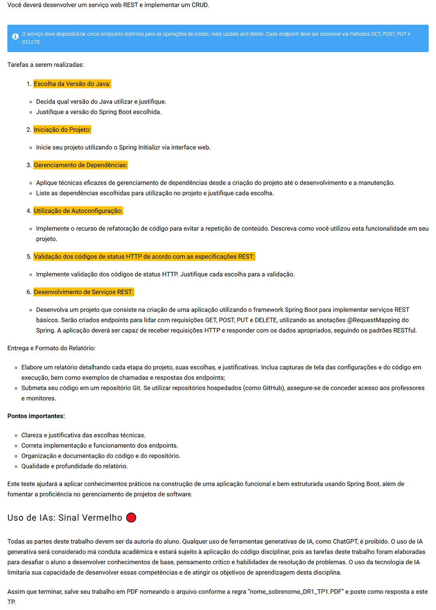

# Desenvolvimento de Serviços com SpringBoot

# TP2 - Questões (6)

# Modo de Uso:
- No projeto abra o arquivo src>main>java>com.infnet.TP2>Tp2Application e clique em play
- No POSTAMAN importe o arquivo "SpringBoot V-I TP2.postman_collection.json" na pasta documentos que contém todas as rotas já criadas e conforme arquivo PDF na pasta documentos faça os devidos testes

